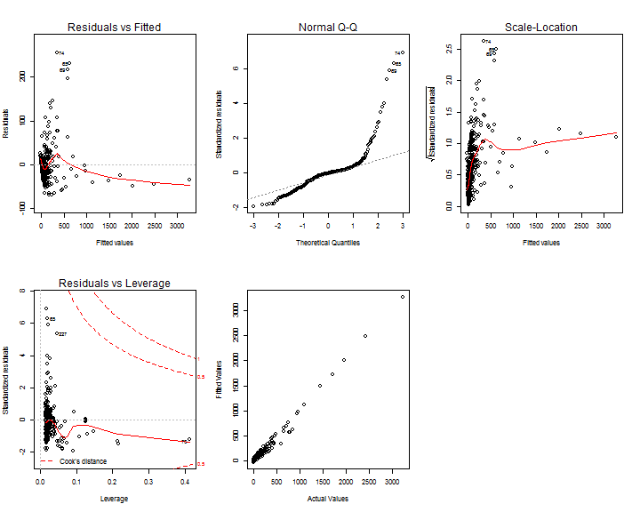
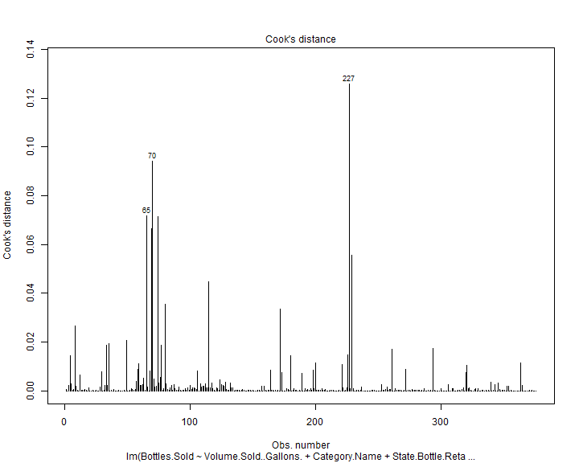
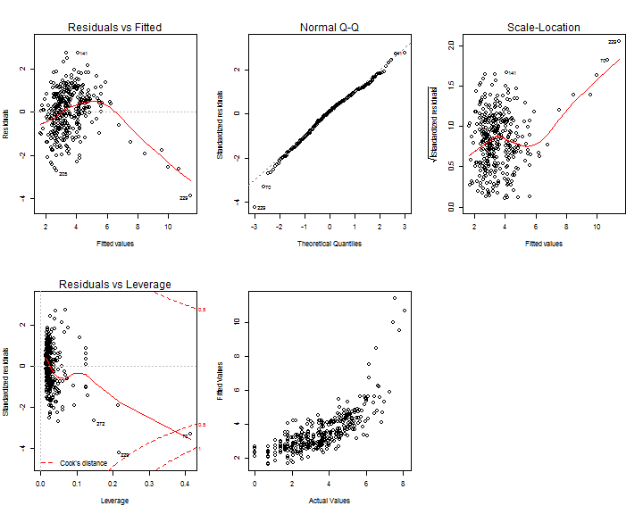
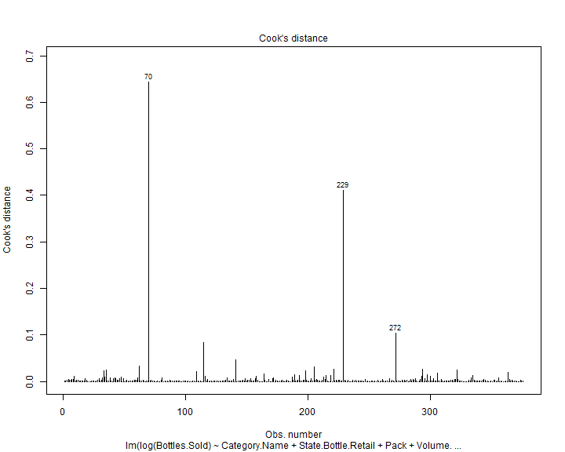
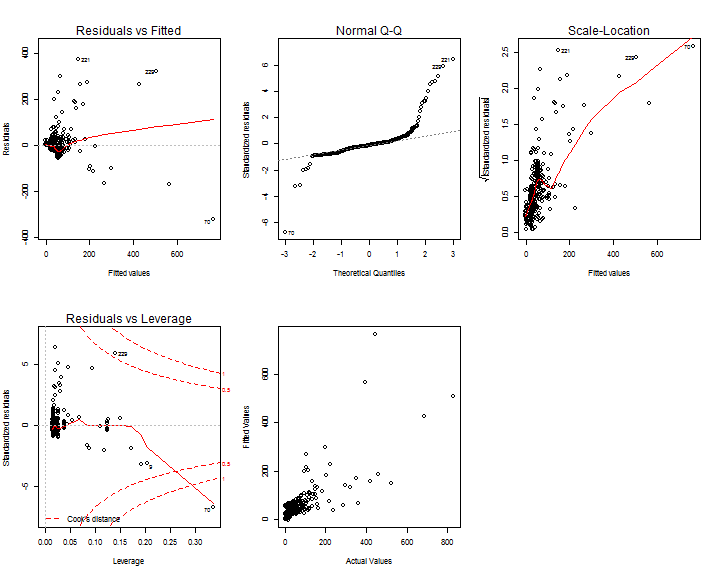
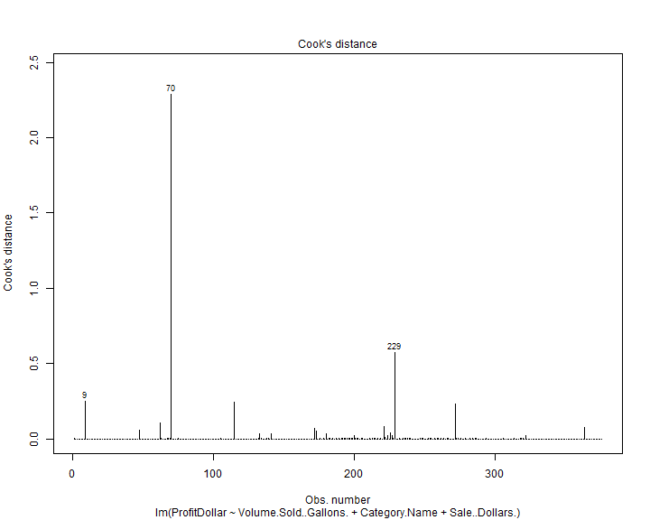
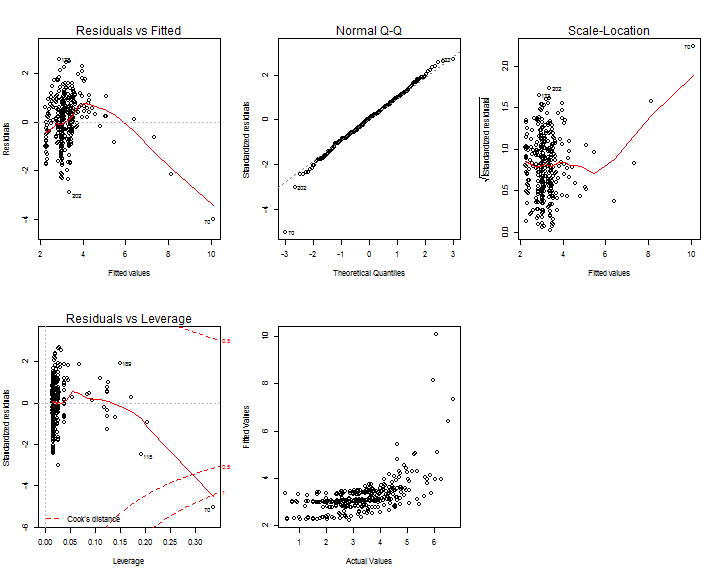
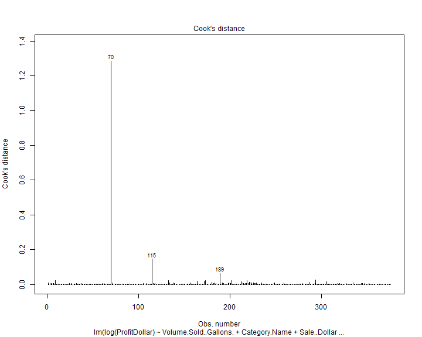

Regional Liquor Sales in Des Moines, Iowa
========================================================
author: Yadu Chittampalli, Christophe Hunt, Senthil Dhanapal 
date: 12/11/2016 

Objectives
========================================================

- To create statistical models for the number of bottles sold and for the profit incurred in Des Moines, Iowa. 

- Make informed decisions on inventory prediction, sales, and assist wholesale distributors in planning for the predicted volume of distribution.

Dataset
========================================================

- The data source contains the spirits purchase information of Iowa Class "E" liquor licensees by product and date of purchase from January 1, 2012 to current.

- The data set is provided by the Iowa Department of Commerce, Alcoholic Beverages Division, [click here](https://data.iowa.gov/Economy/Iowa-Liquor-Sales/m3tr-qhgy) to view the data set at Data.Iowa.Gov.

- The initial data set was 2.68 GB in total size. 

Proposed Methodologies
========================================================

- Model the dependent variable of Bottles Sold for the biggest city in Iowa and Whiskies.

- Accurately model the planned inventory and anticipate production goals for November through the model of Bottles Sold within Des Moines.

- Model Bottles Sold and Profit Dollars to predict the necessary amount of production and the possible profit when producing at the predicted volume.

Challenges
========================================================

- Massive initial dataset that included sales by individual stores and the invoices for each store.

- Determining influential points. 

- Issues with the non-normality of residuals.

Fitted Model for Bottles Sold
========================================================
<font size="5">

```

Call:
lm(formula = Bottles.Sold ~ Volume.Sold..Gallons. + Category.Name + 
    State.Bottle.Retail + Pack + Sale..Dollars., data = dfLiquorSales)

Residuals:
    Min      1Q  Median      3Q     Max 
-72.695 -16.090  -0.885   6.749 253.855 

Coefficients:
                                              Estimate Std. Error t value
(Intercept)                                 -31.761507   7.569680  -4.196
Volume.Sold..Gallons.                         4.093187   0.161694  25.314
Category.NameCANADIAN WHISKIES               36.253685   6.601430   5.492
Category.NameIRISH WHISKIES                  -4.873548   8.076943  -0.603
Category.NameSCOTCH WHISKIES                 -8.116166   8.189151  -0.991
Category.NameSINGLE BARREL BOURBON WHISKIES  12.384335  14.612127   0.848
Category.NameSTRAIGHT BOURBON WHISKIES       -3.416345   6.984605  -0.489
Category.NameSTRAIGHT RYE WHISKIES           17.005140   9.422620   1.805
Category.NameTENNESSEE WHISKIES              -1.310738   7.125047  -0.184
State.Bottle.Retail                           0.079326   0.011121   7.133
Pack                                          2.759534   0.366890   7.521
Sale..Dollars.                               -0.003802   0.001737  -2.189
                                            Pr(>|t|)    
(Intercept)                                 3.42e-05 ***
Volume.Sold..Gallons.                        < 2e-16 ***
Category.NameCANADIAN WHISKIES              7.48e-08 ***
Category.NameIRISH WHISKIES                   0.5466    
Category.NameSCOTCH WHISKIES                  0.3223    
Category.NameSINGLE BARREL BOURBON WHISKIES   0.3973    
Category.NameSTRAIGHT BOURBON WHISKIES        0.6250    
Category.NameSTRAIGHT RYE WHISKIES            0.0719 .  
Category.NameTENNESSEE WHISKIES               0.8541    
State.Bottle.Retail                         5.35e-12 ***
Pack                                        4.27e-13 ***
Sale..Dollars.                                0.0292 *  
---
Signif. codes:  0 '***' 0.001 '**' 0.01 '*' 0.05 '.' 0.1 ' ' 1

Residual standard error: 37.16 on 364 degrees of freedom
Multiple R-squared:  0.9843,	Adjusted R-squared:  0.9838 
F-statistic:  2076 on 11 and 364 DF,  p-value: < 2.2e-16
```
</font>

Diagnostic Plots for the Fitted Model for Bottles Sold
========================================================

- The q-q plot does not show normal distribution. It shows exponential distribution.



Removing Influence Points for the Fitted Model for Bottles Sold
========================================================
- The influence points were removed from this model based on Cook's Distance plot due to our comfort with it being included in base R. The plot indicates the identification number of points appropriate for removal (65, 70, 227). 




Fitted Model for Bottles Sold (After Transformation)
========================================================
- Logarithmic transformation was done on the target variable.
<font size="4">

```

Call:
lm(formula = log(Bottles.Sold) ~ State.Bottle.Cost + Category.Name + 
    State.Bottle.Retail + Pack + Volume.Sold..Gallons. + Bottle.Volume..ml., 
    data = dfLiquorSales)

Residuals:
    Min      1Q  Median      3Q     Max 
-3.3090 -0.6731  0.1172  0.6724  2.6814 

Coefficients:
                                              Estimate Std. Error t value
(Intercept)                                  1.7441851  0.4383525   3.979
State.Bottle.Cost                            0.8639933  0.2124962   4.066
Category.NameCANADIAN WHISKIES               0.6769345  0.1871911   3.616
Category.NameIRISH WHISKIES                 -0.7737756  0.2211110  -3.499
Category.NameSCOTCH WHISKIES                -0.7399199  0.2161457  -3.423
Category.NameSINGLE BARREL BOURBON WHISKIES -0.8810443  0.4226789  -2.084
Category.NameSTRAIGHT BOURBON WHISKIES      -0.2181826  0.1997377  -1.092
Category.NameSTRAIGHT RYE WHISKIES          -0.6341712  0.2799648  -2.265
Category.NameTENNESSEE WHISKIES             -0.3282771  0.1941032  -1.691
State.Bottle.Retail                         -0.5722540  0.1414436  -4.046
Pack                                         0.0609957  0.0141680   4.305
Volume.Sold..Gallons.                        0.0033612  0.0010766   3.122
Bottle.Volume..ml.                           0.0006440  0.0002443   2.636
                                            Pr(>|t|)    
(Intercept)                                 8.36e-05 ***
State.Bottle.Cost                           5.87e-05 ***
Category.NameCANADIAN WHISKIES              0.000341 ***
Category.NameIRISH WHISKIES                 0.000524 ***
Category.NameSCOTCH WHISKIES                0.000689 ***
Category.NameSINGLE BARREL BOURBON WHISKIES 0.037820 *  
Category.NameSTRAIGHT BOURBON WHISKIES      0.275406    
Category.NameSTRAIGHT RYE WHISKIES          0.024090 *  
Category.NameTENNESSEE WHISKIES             0.091647 .  
State.Bottle.Retail                         6.37e-05 ***
Pack                                        2.15e-05 ***
Volume.Sold..Gallons.                       0.001940 ** 
Bottle.Volume..ml.                          0.008757 ** 
---
Signif. codes:  0 '***' 0.001 '**' 0.01 '*' 0.05 '.' 0.1 ' ' 1

Residual standard error: 1.011 on 363 degrees of freedom
Multiple R-squared:  0.6009,	Adjusted R-squared:  0.5877 
F-statistic: 45.54 on 12 and 363 DF,  p-value: < 2.2e-16
```
</font>
Diagnostic Plots for the Fitted Model for Bottles Sold (After Transformation)
========================================================

- The q-q plot for the transformed model does show normal distribution. 



Removing Influence Points for the Fitted Model for Bottles Sold (After Transformation)
========================================================
- Similar to the first model, the influence points were removed from this model based on Cook's Distance. Points 70, 229, and 272 were removed from this model. 



Fitted Model for Profit Dollars
========================================================
<font size="5">

```

Call:
lm(formula = ProfitDollar ~ Volume.Sold..Gallons. + Category.Name + 
    Sale..Dollars., data = dfLiquorSales)

Residuals:
    Min      1Q  Median      3Q     Max 
-319.97  -20.07   -6.56    6.94  373.26 

Coefficients:
                                             Estimate Std. Error t value
(Intercept)                                 -1.774727   8.092145  -0.219
Volume.Sold..Gallons.                        1.695652   0.237787   7.131
Category.NameCANADIAN WHISKIES              25.144827  10.301079   2.441
Category.NameIRISH WHISKIES                 23.256489  12.611248   1.844
Category.NameSCOTCH WHISKIES                55.807192  12.372953   4.510
Category.NameSINGLE BARREL BOURBON WHISKIES 31.181596  22.245741   1.402
Category.NameSTRAIGHT BOURBON WHISKIES      54.112649  10.599481   5.105
Category.NameSTRAIGHT RYE WHISKIES          22.644075  14.061281   1.610
Category.NameTENNESSEE WHISKIES             24.333249  11.121493   2.188
Sale..Dollars.                              -0.009381   0.002682  -3.498
                                            Pr(>|t|)    
(Intercept)                                 0.826527    
Volume.Sold..Gallons.                       5.36e-12 ***
Category.NameCANADIAN WHISKIES              0.015120 *  
Category.NameIRISH WHISKIES                 0.065976 .  
Category.NameSCOTCH WHISKIES                8.73e-06 ***
Category.NameSINGLE BARREL BOURBON WHISKIES 0.161856    
Category.NameSTRAIGHT BOURBON WHISKIES      5.32e-07 ***
Category.NameSTRAIGHT RYE WHISKIES          0.108176    
Category.NameTENNESSEE WHISKIES             0.029305 *  
Sale..Dollars.                              0.000527 ***
---
Signif. codes:  0 '***' 0.001 '**' 0.01 '*' 0.05 '.' 0.1 ' ' 1

Residual standard error: 58.46 on 366 degrees of freedom
Multiple R-squared:  0.5751,	Adjusted R-squared:  0.5647 
F-statistic: 55.04 on 9 and 366 DF,  p-value: < 2.2e-16
```
</font>
Diagnostic Plots for the Fitted Model for Profit Dollars
========================================================

- The q-q plot does not show normal distribution. It shows exponential distribution.



Removing Influence Points for the Fitted Model for Profit Dollars
========================================================
- Similar to the previous models, the influence points were removed from this model based on Cook's Distance. Points 9, 70, and 229 were removed from this model.



Fitted Model for Profit Dollars (After Transformation)
========================================================
- Logarithmic transformation was done on the target variable.

<font size="4"> 

```

Call:
lm(formula = log(ProfitDollar) ~ Volume.Sold..Gallons. + Category.Name + 
    Sale..Dollars. + Bottle.Volume..ml., data = dfLiquorSales)

Residuals:
    Min      1Q  Median      3Q     Max 
-3.8929 -0.5899  0.0554  0.5980  2.5820 

Coefficients:
                                              Estimate Std. Error t value
(Intercept)                                  1.8373721  0.2082275   8.824
Volume.Sold..Gallons.                        0.0211009  0.0039423   5.352
Category.NameCANADIAN WHISKIES               1.1201029  0.1741851   6.431
Category.NameIRISH WHISKIES                  0.6750245  0.2118201   3.187
Category.NameSCOTCH WHISKIES                 1.1113010  0.2045016   5.434
Category.NameSINGLE BARREL BOURBON WHISKIES  1.0155722  0.3692579   2.750
Category.NameSTRAIGHT BOURBON WHISKIES       0.8331466  0.1795056   4.641
Category.NameSTRAIGHT RYE WHISKIES           0.6129959  0.2350768   2.608
Category.NameTENNESSEE WHISKIES              0.9159501  0.1904562   4.809
Sale..Dollars.                              -0.0001535  0.0000444  -3.457
Bottle.Volume..ml.                           0.0004250  0.0001644   2.585
                                            Pr(>|t|)    
(Intercept)                                  < 2e-16 ***
Volume.Sold..Gallons.                       1.54e-07 ***
Category.NameCANADIAN WHISKIES              3.99e-10 ***
Category.NameIRISH WHISKIES                 0.001563 ** 
Category.NameSCOTCH WHISKIES                1.01e-07 ***
Category.NameSINGLE BARREL BOURBON WHISKIES 0.006250 ** 
Category.NameSTRAIGHT BOURBON WHISKIES      4.83e-06 ***
Category.NameSTRAIGHT RYE WHISKIES          0.009491 ** 
Category.NameTENNESSEE WHISKIES             2.22e-06 ***
Sale..Dollars.                              0.000611 ***
Bottle.Volume..ml.                          0.010113 *  
---
Signif. codes:  0 '***' 0.001 '**' 0.01 '*' 0.05 '.' 0.1 ' ' 1

Residual standard error: 0.9658 on 365 degrees of freedom
Multiple R-squared:  0.3641,	Adjusted R-squared:  0.3467 
F-statistic:  20.9 on 10 and 365 DF,  p-value: < 2.2e-16
```
</font>

Diagnostic Plots for the Fitted Model for Profit Dollars (After Transformation)
========================================================
- The q-q plot for the transformed model does show normal distribution.



Removing Influence Points for the Fitted Model for Profit Dollars (After Transformation)
========================================================

- Similar to the previous models, the influence points were removed from this model based on Cook's Distance. Points 70, 115, and 189 were removed from this model.



Table of AIC Values
========================================================

- The computed AIC values are shown below. When the target variable is transformed, the model performs better.

<table class='gmisc_table' style='border-collapse: collapse; margin-top: 1em; margin-bottom: 1em;' >
<thead>
<tr><td colspan='2' style='text-align: left;'>
AIC Values</td></tr>
<tr>
<th style='border-bottom: 1px solid grey; border-top: 2px solid grey; text-align: center;'>Model Name</th>
<th style='border-bottom: 1px solid grey; border-top: 2px solid grey; text-align: center;'>AIC</th>
</tr>
</thead>
<tbody>
<tr>
<td style='text-align: center;'>Bottles Sold</td>
<td style='text-align: center;'>3802.454</td>
</tr>
<tr>
<td style='text-align: center;'>Log Bottles Sold</td>
<td style='text-align: center;'>1104.635</td>
</tr>
<tr>
<td style='text-align: center;'>Profit Dollars</td>
<td style='text-align: center;'>4138.328</td>
</tr>
<tr>
<td style='border-bottom: 2px solid grey; text-align: center;'>Log of Profit Dollars</td>
<td style='border-bottom: 2px solid grey; text-align: center;'>1058.5</td>
</tr>
</tbody>
</table>

Possibility of Future Works
========================================================

- Some robust models using techniques described in other papers using network-based methodology, ARIMA methodology, neural networks, and advanced hybrid neural networks. 

- Models based on each type of whisky within the whisky category may perform better.

- Regional analysis for states with different regulations regarding liquor sales because research shows that people can cross state borders.  
