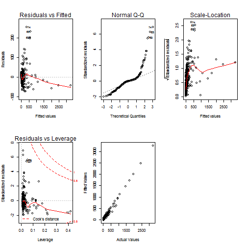

Liquor Sales in Iowa
========================================================
author: Yadu Chittampalli, Christophe Hunt, Senthil Dhanapal 
date: 12/11/2016 

Objectives
========================================================

- To create statistical models for the volume of liquor sold in gallons and for the profit incurred in Des Moines, Iowa. 
- Make informed decisions on inventory prediction, sales, and assist wholesale distributors in planning for the predicted volume of distribution.

Proposed Methodologies
========================================================

- Model the dependent variable of Volume Sold in Gallons by top counties and top liquor categories.

- Accurately predict the planned inventory and anticipate production goals through the model of volume sold entirely by the state of Iowa.

- Model volume sold and profit to predict the necessary volume of production and the possible profit when producing at the predicted volume.

Challenges
========================================================

- Massive initial dataset that included sales by individual stores and the invoices for each store

- Overdispersion and negative skew in Volume Sold (Gallons) when modeling it by top counties and top liquor categories. 

First Fitted Model
========================================================


```
$coefficients
                                (Intercept) 
                              -31.761507381 
                      Volume.Sold..Gallons. 
                                4.093186870 
             Category.NameCANADIAN WHISKIES 
                               36.253685179 
                Category.NameIRISH WHISKIES 
                               -4.873547580 
               Category.NameSCOTCH WHISKIES 
                               -8.116166036 
Category.NameSINGLE BARREL BOURBON WHISKIES 
                               12.384335434 
     Category.NameSTRAIGHT BOURBON WHISKIES 
                               -3.416344742 
         Category.NameSTRAIGHT RYE WHISKIES 
                               17.005140268 
            Category.NameTENNESSEE WHISKIES 
                               -1.310737660 
                        State.Bottle.Retail 
                                0.079326197 
                                       Pack 
                                2.759533929 
                             Sale..Dollars. 
                               -0.003802026 
```


Diagnostic Plots for the First Fitted Model
========================================================

- The q-q plot does not show normal distribution. Shows exponential distribution.


